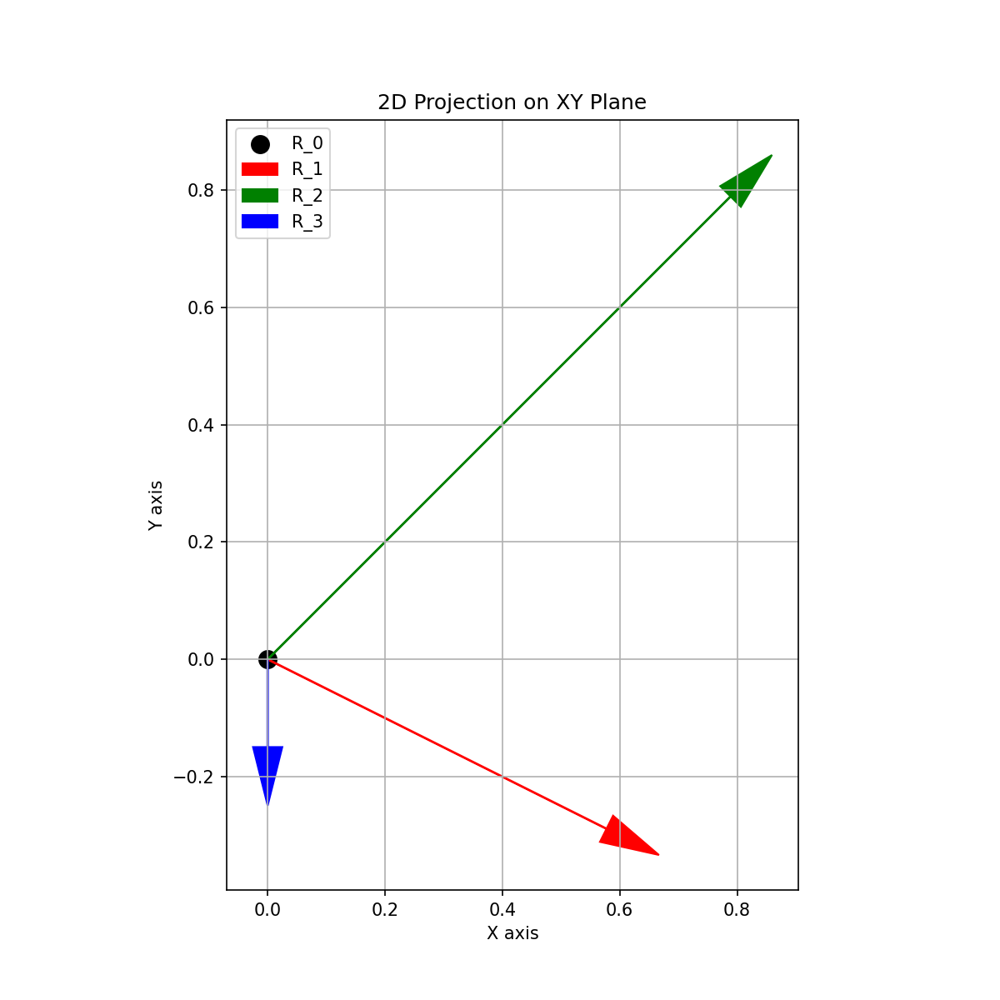

# Orthogonal Vectors Generator and Visualizer

This documentation provides a comprehensive guide to the generalized implementation of the Orthogonal Vectors Generator and Visualizer.

## Table of Contents

1. [Introduction](#introduction)
2. [Installation](#installation)
3. [Package Structure](#package-structure)
4. [API Reference](#api-reference)
5. [Usage Examples](#usage-examples)
6. [Example Results](#example-results)
7. [Command-line Interface](#command-line-interface)
8. [Configuration Management](#configuration-management)

## Introduction

The Orthogonal Vectors Generator and Visualizer is a Python package that creates and visualizes three orthogonal vectors from a given origin point. This generalized implementation provides a modular and configurable approach to vector generation and visualization.

## Installation

1. Clone the repository:
   ```bash
   git clone <repository-url>
   cd arrowhead
   ```

2. Create a virtual environment:
   ```bash
   python -m venv venv
   ```

3. Activate the virtual environment:
   - On Linux/Mac:
     ```bash
     source venv/bin/activate
     ```
   - On Windows:
     ```bash
     venv\Scripts\activate
     ```

4. Install the required packages:
   ```bash
   pip install -r requirements.txt
   ```

## Package Structure

The package is organized into the following modules:

- `vector_utils.py`: Vector calculation utilities
- `visualization.py`: Visualization functions
- `config.py`: Configuration management
- `main.py`: Command-line interface
- `example.py`: Example usage
- `__init__.py`: Package initialization and exports

## API Reference

### Vector Utilities (`vector_utils.py`)

#### `create_orthogonal_vectors(R_0=(0, 0, 0), d=1, theta=0)`

Create three orthogonal vectors from a given origin.

**Parameters:**
- `R_0` (tuple or numpy.ndarray): The origin vector, default is (0, 0, 0)
- `d` (float): The distance parameter, default is 1
- `theta` (float): The angle parameter in radians, default is 0

**Returns:**
- tuple: Three orthogonal vectors R_1, R_2, R_3

#### `check_orthogonality(R_0, R_1, R_2, R_3)`

Check if the vectors are orthogonal with respect to the origin.

**Parameters:**
- `R_0`, `R_1`, `R_2`, `R_3` (numpy.ndarray): The vectors to check

**Returns:**
- dict: Dictionary containing the dot products between pairs of vectors

### Visualization (`visualization.py`)

#### `plot_vectors_3d(R_0, R_1, R_2, R_3, figsize=(10, 8), show_legend=True)`

Plot the vectors in 3D.

**Parameters:**
- `R_0` (numpy.ndarray): The origin vector
- `R_1`, `R_2`, `R_3` (numpy.ndarray): The three orthogonal vectors
- `figsize` (tuple): Figure size (width, height) in inches
- `show_legend` (bool): Whether to show the legend

**Returns:**
- tuple: (fig, ax) matplotlib figure and axis objects

#### `plot_vectors_2d_projection(R_0, R_1, R_2, R_3, plane='xy', figsize=(8, 8), show_legend=True, show_grid=True)`

Plot a 2D projection of the vectors.

**Parameters:**
- `R_0` (numpy.ndarray): The origin vector
- `R_1`, `R_2`, `R_3` (numpy.ndarray): The three orthogonal vectors
- `plane` (str): The plane to project onto ('xy', 'xz', 'yz', or 'r0')
- `figsize` (tuple): Figure size (width, height) in inches
- `show_legend` (bool): Whether to show the legend
- `show_grid` (bool): Whether to show the grid

**Returns:**
- tuple: (fig, ax) matplotlib figure and axis objects

#### `plot_all_projections(R_0, R_1, R_2, R_3, show_r0_plane=True, figsize_3d=(10, 8), figsize_2d=(8, 8))`

Plot all projections of the vectors.

**Parameters:**
- `R_0` (numpy.ndarray): The origin vector
- `R_1`, `R_2`, `R_3` (numpy.ndarray): The three orthogonal vectors
- `show_r0_plane` (bool): Whether to show the R_0 plane projection
- `figsize_3d` (tuple): Figure size for 3D plot
- `figsize_2d` (tuple): Figure size for 2D plots

**Returns:**
- dict: Dictionary containing all figure and axis objects

### Configuration (`config.py`)

#### `VectorConfig` class

Configuration class for vector generation and visualization.

**Constructor Parameters:**
- `R_0` (tuple or list): The origin vector, default is (0, 0, 0)
- `d` (float): The distance parameter, default is 1
- `theta` (float): The angle parameter in radians, default is π/4
- `show_r0_plane` (bool): Whether to show the R_0 plane projection, default is True
- `figsize_3d` (tuple): Figure size for 3D plot, default is (10, 8)
- `figsize_2d` (tuple): Figure size for 2D plots, default is (8, 8)
- `show_legend` (bool): Whether to show the legend, default is True
- `show_grid` (bool): Whether to show the grid, default is True

**Methods:**
- `to_dict()`: Convert the configuration to a dictionary
- `from_dict(config_dict)`: Create a configuration from a dictionary (class method)
- `save_to_file(filename)`: Save the configuration to a JSON file
- `load_from_file(filename)`: Load a configuration from a JSON file (class method)

## Usage Examples

### Basic Usage

```python
import numpy as np
import matplotlib.pyplot as plt
from generalized import create_orthogonal_vectors, plot_all_projections

# Create orthogonal vectors with default parameters
R_0 = np.array([0, 0, 0])
R_1, R_2, R_3 = create_orthogonal_vectors(R_0)

# Plot the vectors
plots = plot_all_projections(R_0, R_1, R_2, R_3)
plt.show()
```

### Custom Parameters

```python
import numpy as np
import matplotlib.pyplot as plt
import math
from generalized import create_orthogonal_vectors, plot_all_projections

# Create orthogonal vectors with custom parameters
R_0 = np.array([1, 1, 1])  # Non-origin starting point
d = 2                      # Distance parameter
theta = math.pi/3          # 60 degrees in radians

R_1, R_2, R_3 = create_orthogonal_vectors(R_0, d, theta)

# Plot the vectors
plots = plot_all_projections(R_0, R_1, R_2, R_3)
plt.show()
```

### Using Configuration

```python
import matplotlib.pyplot as plt
from generalized import VectorConfig, create_orthogonal_vectors, plot_all_projections

# Create a configuration
config = VectorConfig(
    R_0=(0, 0, 2),  # Point on z-axis
    d=1.5,          # Medium distance
    theta=math.pi/6 # 30 degrees
)

# Create the orthogonal vectors
R_0 = config.R_0
R_1, R_2, R_3 = create_orthogonal_vectors(R_0, config.d, config.theta)

# Plot the vectors
plots = plot_all_projections(
    R_0, R_1, R_2, R_3,
    show_r0_plane=config.show_r0_plane,
    figsize_3d=config.figsize_3d,
    figsize_2d=config.figsize_2d
)
plt.show()
```

### Saving and Loading Configurations

```python
from generalized import VectorConfig

# Create a configuration
config = VectorConfig(
    R_0=(2, 0, 1),
    d=1.5,
    theta=math.pi/6
)

# Save the configuration to a file
config.save_to_file("my_config.json")

# Load the configuration from the file
loaded_config = VectorConfig.load_from_file("my_config.json")
```

## Example Results

### Default Configuration

Using the default configuration:
- R_0 = [0, 0, 0]
- d = 1
- theta = π/4 (45 degrees)

Results in the following vectors:
- R_0: [0, 0, 0]
- R_1: [0.577, -0.289, -0.289]
- R_2: [0.789, 0.789, 0.789]
- R_3: [0, -0.149, 0.149]

Orthogonality check (dot products should be close to zero):
- R_1 · R_2: 0.0
- R_1 · R_3: 0.0
- R_2 · R_3: 0.0

#### 3D Visualization


#### 2D Projections

XY Plane:



XZ Plane:


YZ Plane:


R_0 Plane:


### Custom Configuration 1

Using custom configuration:
- R_0 = [1, 1, 1]
- d = 2
- theta = π/3 (60 degrees)

Results in the following vectors:
- R_0: [1, 1, 1]
- R_1: [1.816, 0.592, 0.592]
- R_2: [2.633, 2.633, 2.633]
- R_3: [1, 0.423, 1.577]

Orthogonality check (dot products should be close to zero):
- R_1 · R_2: 0.0
- R_1 · R_3: -5.55e-17 (effectively zero)
- R_2 · R_3: 1.11e-16 (effectively zero)

#### 3D Visualization


#### 2D Projections

XY Plane:


XZ Plane:


YZ Plane:


R_0 Plane:


### Custom Configuration 2

Using custom configuration:
- R_0 = [0, 0, 2]
- d = 1.5
- theta = π/6 (30 degrees)

Results in the following vectors:
- R_0: [0, 0, 2]
- R_1: [1.061, -0.530, 1.470]
- R_2: [1.061, 1.061, 3.061]
- R_3: [0, 1.25e-16, 2.000]

Orthogonality check (dot products should be close to zero):
- R_1 · R_2: 1.11e-16 (effectively zero)
- R_1 · R_3: 5.15e-17 (effectively zero)
- R_2 · R_3: -1.03e-16 (effectively zero)

#### 3D Visualization


#### 2D Projections

XY Plane:


XZ Plane:


YZ Plane:


R_0 Plane:


## Command-line Interface

The package provides a command-line interface through `main.py`.

### Basic Usage

```bash
python main.py
```

This will generate orthogonal vectors with default parameters and display the plots.

```bash
python main.py help
```

This will display detailed help information about all available commands and options.

### Command-line Options

```bash
python main.py -R 1 1 1 -d 2 -a 1.047
```

This will generate orthogonal vectors with the specified origin (1,1,1), distance (2), and angle (π/3 radians). Note the use of the shorter `-R` flag for specifying the origin coordinates.

### Saving Plots

```bash
python main.py --save-plots --output-dir my_plots
```

This will save the plots to the `my_plots` directory instead of displaying them.

### Full List of Options

```
usage: main.py [-h] [--origin ORIGIN ORIGIN ORIGIN] [--distance DISTANCE] [--angle ANGLE]
               [--no-r0-plane] [--no-legend] [--no-grid] [--save-plots]
               [--output-dir OUTPUT_DIR] [--config CONFIG] [--save-config SAVE_CONFIG]

Generate and visualize orthogonal vectors

options:
  -h, --help            show this help message and exit
  --origin ORIGIN ORIGIN ORIGIN, -R ORIGIN ORIGIN ORIGIN
                        Origin vector R_0 (x y z)
  --distance DISTANCE, -d DISTANCE
                        Distance parameter d
  --angle ANGLE, -a ANGLE
                        Angle parameter theta in radians
  --no-r0-plane         Do not show the R_0 plane projection
  --no-legend           Do not show the legend
  --no-grid             Do not show the grid
  --save-plots          Save plots to files instead of displaying them
  --output-dir OUTPUT_DIR
                        Directory to save plots to
  --config CONFIG       Path to configuration file
  --save-config SAVE_CONFIG
                        Save configuration to file
```

### Detailed Help

The package also provides a detailed help command that gives examples and more context:

```bash
python main.py help
```

This will display comprehensive information about all available commands, parameters, and usage examples.
```

## R_0 Plane Projection Scripts

The package includes specialized scripts for generating R_0 plane projections, which provide a clear view of the orthogonality of the vectors in the plane perpendicular to the origin direction.

### generate_r0_projections.py

This script generates R_0 plane projections for various configurations with improved axis handling, symmetric axis limits, and better legend placement.

```bash
python docs/generate_r0_projections.py
```

Features:
- Dynamic axis limit calculation with a 20% margin to ensure all vector projections are visible
- Symmetric axis limits for better visual representation
- Improved grid for better readability
- Enhanced legend placement

### generate_combined_views.py

This script generates combined 3D and R_0 plane projection figures, showing both perspectives side by side.

```bash
python docs/generate_combined_views.py
```

Features:
- Side-by-side visualization of 3D vectors and their R_0 plane projections
- Consistent styling and coloring across both views
- Improved axis handling for R_0 plane projections

### generate_specific_r0_projections.py

This script generates R_0 plane projections specifically for the three combined effect configurations (origins at (0,0,0), (1,1,1), and (0,0,2)).

```bash
python docs/generate_specific_r0_projections.py
```

Features:
- Focused on the three main configurations used in the documentation
- Enhanced visualization techniques for clarity
- Consistent styling with other visualizations

## Configuration Management

The package provides a configuration management system through the `VectorConfig` class.

### Creating a Configuration

```python
from generalized import VectorConfig

config = VectorConfig(
    R_0=(1, 1, 1),
    d=2,
    theta=math.pi/3,
    show_r0_plane=True,
    figsize_3d=(12, 10),
    figsize_2d=(8, 8),
    show_legend=True,
    show_grid=True
)
```

### Saving a Configuration

```python
config.save_to_file("my_config.json")
```

This will create a JSON file with the configuration:

```json
{
    "R_0": [1, 1, 1],
    "d": 2,
    "theta": 1.0471975511965976,
    "show_r0_plane": true,
    "figsize_3d": [12, 10],
    "figsize_2d": [8, 8],
    "show_legend": true,
    "show_grid": true
}
```

### Loading a Configuration

```python
loaded_config = VectorConfig.load_from_file("my_config.json")
```

### Using a Configuration with Command-line Interface

```bash
# Save a configuration
python main.py --origin 1 1 1 --distance 2 --angle 1.047 --save-config my_config.json

# Load a configuration
python main.py --config my_config.json
```
